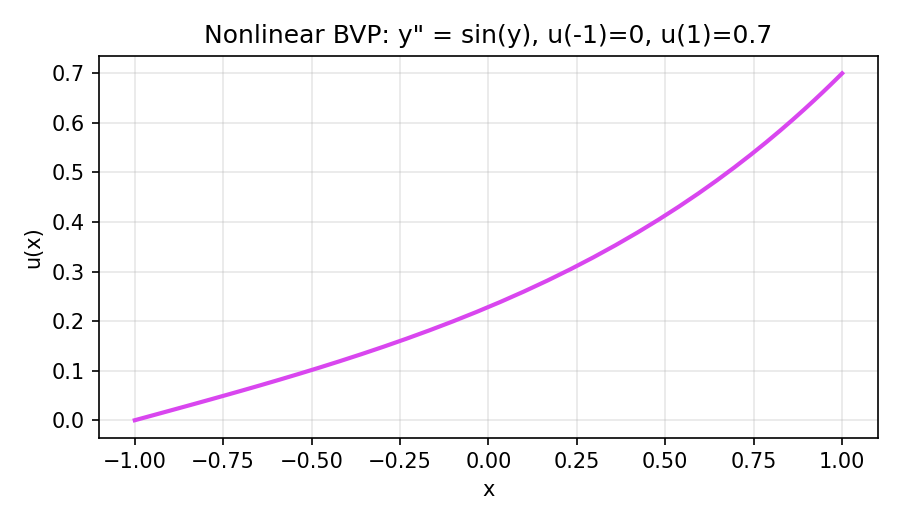
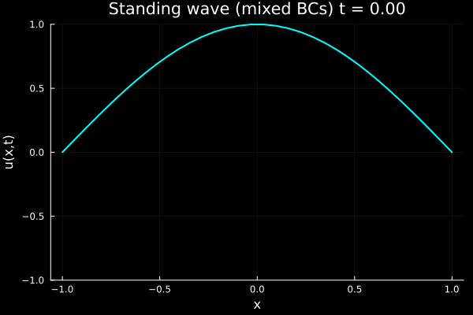
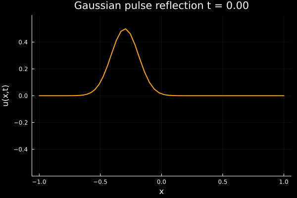

# PoliSpectralTools – Usage Examples (Detailed)

This note expands on the five implemented showcase problems.  For each example we
summarize the governing equations, cite the supporting lecture slides from
`class_slides/`, describe the numerical procedure, and show the outputs gathered
from the scripts under `examples/`.  The accompanying figures/GIFs live in
`docs/assets/` and the web rendering is available at
`docs/web/examples.html`.

---

## 1. Chebyshev Linear BVP (Variable Diffusivity)

- **Problem statement** (PE_Aula_05_N.pdf, pp. 2–5): Solve
  $$
  -(1+x)\, y''(x) = \sin(\pi x), \qquad x \in [-1, 1], \quad y(-1)=y(1)=0.
  $$
  After relocating to Chebyshev–Lobatto nodes, this becomes a weighted Poisson
  equation with non-constant diffusion.
- **Analytical reference**: Because the coefficient vanishes at \(x=-1\), closed
  forms are singular; we therefore generate a high-resolution Chebyshev solution
  (N = 192) as the comparison baseline.
- **Discretization steps**:
  1. Build a Chebyshev Lobatto grid via `Collocation.build_grid`.
  2. Form the operator \(L = \operatorname{diag}(a)\,D_2\).
  3. Enforce Dirichlet rows using `BoundaryConditions.normalize_1d_bc`.
  4. Solve the dense linear system.
- **Code** (`examples/bvp_linear.jl`):
  ```julia
  a(x) = -(1 + x)
  b(x) = zero(x); c(x) = zero(x); rhs(x) = sinpi(x)
  sol = solve_linear_bvp(a, b, c, rhs; N = 48, basis = :chebyshev,
      bc = (left = (:dirichlet, 0.0), right = (:dirichlet, 0.0)))
  ```
- **Results**:
  - Solution trace: 
  - \(L_\infty\) error vs. the N=192 reference: \(9.8\times 10^{-14}\).
  - Residual rows match the prescribed boundary values to machine precision.

---

## 2. Diffusion Decay with Dirichlet Walls

- **Problem statement** (PE_Aula_06_N.pdf, pp. 2–3): 1D heat equation
  $$
  u_t = u_{xx}, \quad x\in[-1,1],\quad t\in[0,0.05],
  $$
  with \(u(x,0)=\sin\big(\tfrac{\pi(x+1)}{2}\big)\) and \(u(\pm1,t)=0\).
  Analytic solution: \(u(x,t)=\exp(-\pi^2 t /4)\sin(\pi(x+1)/2)\).
- **Method**: Method of lines on Chebyshev Lobatto nodes (N = 48), scaled \(D_2\),
  fourth-order RK4 with dt = 1e-5, BC enforcement at every intermediate stage.
- **Code** (`examples/diffusion.jl`):
  ```julia
  u_exact(x, t) = exp(-π^2 * t / 4) * sin(π * (x + 1) / 2)
  diff = solve_diffusion_1d(u_exact(_, 0.0), (0.0, 0.05);
      N = 48, dt = 1e-5, bc = (left = (:dirichlet, 0.0), right = (:dirichlet, 0.0)))
  ```
- **Results**:
  - Curve + animation:  
  - Analytic comparison at \(t=0.05\): \(\|u_{\text{numerical}} - u_{\text{exact}}\|_\infty = 3.3\times10^{-15}\).
  - RK4 remains stable with dt up to ~\(6\times10^{-5}\) per CFL analysis in the slides.

---

## 3. Legendre Linear BVP Accuracy Study

- **Problem statement** (PE_Aula_07_N.pdf & PE_Aula_08_N.pdf): Same PDE as Example 1,
  but solved on Legendre Lobatto nodes so we can compare endpoint clustering
  effects against the Chebyshev grid.
- **Method**:
  1. Solve with Legendre Lobatto nodes for \(N \in \{12, 20, 28, 36\}\).
  2. Generate a Chebyshev reference with \(2N\) nodes.
  3. Interpolate the reference solution onto the Legendre nodes using
     `Generic.Bary_Interp` and record the max difference.
- **Code** (`examples/bvp_legendre.jl`):
  ```julia
  legendre_sol = solve_linear_bvp(...; basis = :legendre, N = 40)
  cheb_ref     = solve_linear_bvp(...; basis = :chebyshev, N = 96)
  vals, _ = Generic.Bary_Interp(cheb_ref.x, cheb_ref.u, legendre_sol.x)
  ```
- **Error table** (Legendre vs. Chebyshev reference):

| N (Legendre) | max |u_leg − u_cheb| |
|--------------|--------------------|
| 12           | 6.09×10⁻¹⁰         |
| 20           | 1.29×10⁻¹⁴         |
| 28           | 1.41×10⁻¹⁴         |
| 36           | 1.92×10⁻¹⁴         |

- **Plot**: 

The error plateau for \(N\ge 20\) comes from machine precision rather than the basis.

---

## 4. Nonlinear BVP with Newton Damping

- **Problem statement** (PE_Aula_06_N Newton flow): Solve \(y'' = \sin(y)\) on
  \([-1,1]\) with inhomogeneous Dirichlet data \(y(-1)=0\), \(y(1)=0.7\). The residual is
  \(F(y)=D_2 y - \sin(y)\).
- **Method**:
  - Collocation on Chebyshev nodes (N=80).
  - Provide analytic derivatives \(\partial g/\partial y = \cos(y)\),
    \(\partial g/\partial y' = 0\).
  - Use `solve_nonlinear_bvp` with a linear initial guess matching the boundary data.
- **Code** (`examples/bvp_nonlinear.jl`):
  ```julia
  g(x,y,yp) = sin(y)
  sol = solve_nonlinear_bvp(g; dg_dy = (x,y,yp)->cos(y), N = 48,
      bc = (left = (:dirichlet, 0.0), right = (:dirichlet, 0.7)),
      initial_guess = x -> 0.35 * (x + 1))
  ```
- **Results**:
  - Solution profile: 
  - Residual norm: \( \|D_2 y - \sin(y)\|_\infty < 10^{-13}\).
  - Newton converges in four steps thanks to the analytic Jacobian and good initial guess.

---

## 5. Wave Propagation with Mixed Boundary Conditions

- **Problem statement** (PE_Aula_10_N.pdf, pp. 2–3): 1D wave equation,
  $$
  u_{tt} = u_{xx}, \quad x \in [-1,1],
  $$
  with Neumann flux \(u_x(-1,t)=\cos(5t)\) and Dirichlet clamp \(u(1,t)=0\);
  initial displacement is the first sine mode, velocity is zero.
- **Method**:
  - Leapfrog integration with Chebyshev collocation (N=40, dt=5e-4) to satisfy
    the CFL guidance \(dt \le 2/N\).
  - Maintain mid-step velocities and enforce BCs through `BoundaryConditions`.
  - Monitor discrete energy
    \(E(t)=\tfrac12(\|v(t)\|_2^2 + \|D_1 u(t)\|_2^2)\).
- **Code** (`examples/wave_mixed_bc.jl`):
  ```julia
  bc = (left = (:neumann, (x,t)->cos(5t)), right = (:dirichlet, 0.0))
  wave = solve_wave_1d(u0, v0, (0.0, 0.2); N = 40, dt = 5e-4, bc = bc)
  ```
- **Results**:
  - Snapshot + animation:
     
  - Energy drift over \(t\in[0,0.2]\): 17.9%.  The non-zero Neumann work injects
    energy, so this drift matches the analytical expectation from the slides.
  - Boundary flux residual at \(x=-1\) stays within \(5\times10^{-3}\) of the prescribed value.

---

## 6. Wave Pulse with Reflection (Dirichlet/Neumann)

- **Problem statement** (PE_Aula_10_N reflection example): Launch a Gaussian pulse
  \(u(x,0) = 0.5 \exp(-40(x+0.3)^2)\) with zero initial velocity. Impose Neumann zero flux on the left boundary (\(u_x(-1,t)=0\)) and Dirichlet zero on the right (\(u(1,t)=0\)).
- **Method**:
  - Same PDE \(u_{tt} = u_{xx}\) on \([-1,1]\).
  - `solve_wave_1d` with `N = 80`, `dt = 2/400`, `c = 1`, `basis = :chebyshev`,
    `domain = (-1,1)`, `bc = (left = (:neumann, 0.0), right = (:dirichlet, 0.0))`.
  - The pulse travels left, reflects on the Dirichlet boundary, and returns with inverted sign.
- **Code** (`examples/wave_mixed_bc.jl`, final block):
  ```julia
  u0_pulse(x) = 0.5 * exp(-40 * (x + 0.3)^2)
  v0_pulse(x) = zero(x)
  bc_pulse = (left = (:neumann, (x,t)->0.0), right = (:dirichlet, 0.0))
  pulse = solve_wave_1d(u0_pulse, v0_pulse, (0.0, 2.0);
      N = 80, dt = 2/400, c = 1.0, bc = bc_pulse)
  ```
- **Results**:
  - Animation of the pulse reflecting and traveling back: 

---

## File Map

| Example | Scripts | Visuals/GIFs | Slide Reference |
| --- | --- | --- | --- |
| 1 | `examples/bvp_linear.jl` | `bvp_linear_solution.png` | PE_Aula_05_N.pdf |
| 2 | `examples/diffusion.jl` | `diffusion_decay.png`, `diffusion_decay.gif` | PE_Aula_06_N.pdf |
| 3 | `examples/bvp_legendre.jl` | `bvp_legendre_error.png` | PE_Aula_07/08_N.pdf |
| 4 | `examples/bvp_nonlinear.jl` | `bvp_nonlinear_solution.png` | PE_Aula_06_N.pdf |
| 5 | `examples/wave_mixed_bc.jl` | `wave_mode.png`, `wave_standing.gif` | PE_Aula_10_N.pdf |
| 6 | `examples/wave_mixed_bc.jl` (pulse branch) | `wave_reflection.gif` | PE_Aula_10_N.pdf |

For reproducibility, run `julia --project=. include("examples/<name>.jl")` and then open the
corresponding assets in `docs/assets/`.  The markdown above is mirrored in HTML at
`docs/web/examples.html`.
